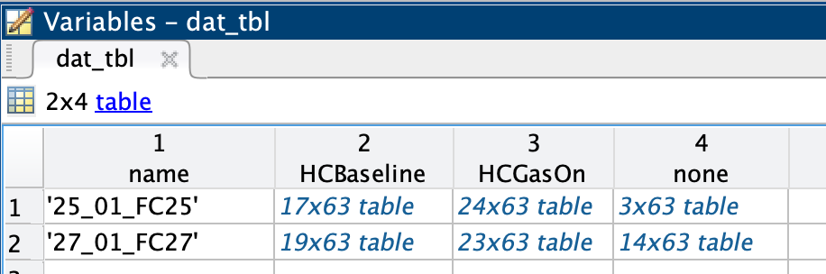

# Pulse Analysis

## Reference

Please see the following reference for more detailed description of this pipeline. If you wish to use the code, please reference this work in any resulting publication:

- T. M. Urner et al."Normative cerebral microvascular blood flow waveform morphology assessed with Diffuse Correlation Spectroscopy," Biomed Opt Express, *in press* (2023)

Please also reference the below publication if using the script `delineator.m`:

- BN Li, MC Dong & MI Vai (2010) 
On an automatic delineator for arterial blood pressure waveforms
Biomedical Signal Processing and Control 5(1) 76-81.

For R code to implement time-waited averaging as discussed in the paper, plase see:

- S. Halvorson, "SvenR," https://github.com/svenhalvorson/SvenR.

## Input Data

Please see the `Example_Data` example input dataset. The code assumes that data is saved with the format `[Subject ID]--[varname].mat`, as shown below. File handling within `pulse_analysis_main.m` is mostly in `parse_db.m`.


| Variable Name      | Description                                                                 | Format               |
|--------------------|-----------------------------------------------------------------------------|----------------------|
| TimeAxis_DCS       | Time axis of the BFI data (Dbfit)|           Column vector time axis of Dbfit (20Hz)           |
| Dbfit              | BFI value for each timepoint determined by fitting to the diffusion model   | Column vector of data taken with source-detector separation 2.5cm |
| Marks_index        | Marks in the data         |    **Column 1:** Original row number <br /> Column 2: Mark number <br /> **Column 3:** time relative to start of acquisition  | 
| raw_ABP_masterdata | ABP data from the CNAP                                                      | A four column vector, but only columns 1-4 are used. <br /> <br /> **Column 1:** Time from start of acquisition (125Hz) <br /> **Column 2** Voltage data read directly off the ABP recording equipment by labview <br /> **Column 3:** ABP data, calculated in labview software. If `cnap` argument is called in `pulse_analysis_main.m` this column is updated from the raw voltage with the appropriate conversion upon loading.     |


## Optional marks input

Data can be sorted into states and substates using an excel spreadsheet and the `Marks_index.mat` variable. Two different examples of state/substate naming are given as 'marks1' and 'marks2' spreadsheets and runfiles. The key terms are `state_start`, `state_end`, `substate start`, and `substate end`. Substate names must have the state name in them too. In the 'marks1' example, the state is a hypercapnia (HC) experiment and the substates are 'HC baseline' and 'HC Gas On'. The 'marks2' example is the same but uses a different naming scheme.

| HC State Start | SubjectID | Run | HC Baseline Substate Start | HC Baseline Substate End | HC Gas On Substate Start | HC Gas On Substate End | HC State End |
|----------------|-----------|-----|----------------------------|--------------------------|--------------------------|------------------------|--------------|
| 27_01_FC27 | 1   | 47              | 47                      | 50                    | 52                              | 58                            | 62             |
| 25_01_FC25 | 1   | 50              | 50                      | 52                    | 52                              | 62                            | 63             |


## Running the code

1) In matlab, go to "Set Path" and select the "add folder with subfolders". Add the parent directory of this example to the search path.
2) Open the desired run script. Three example scripts for running `pulse_analysis_main.m` are given - one with no marks and two examples with marks.
3) Set filepaths such that `data_folder` points to a folder with input data in the example format and `save_dir` is the desired output directory. If a marks spreadsheet is being used, set its path with `analysis table`.

```MATLAB 
%%%%%%%%%%%%%%%%%%
% Set filepaths  %                                                         
%%%%%%%%%%%%%%%%%%
BASEPATH = '/Users/taraurner/BuckleyLab/tmu_code/PIPELINES/20_HEALTHY_PULSATILITY_2023_BOE/PULSEANALYSIS/BOE_GithubExample'
data_folder = [BASEPATH filesep 'ExampleData'];   % BFI and ABP data to be analyzed
analysis_tbl = [BASEPATH filesep 'data_index_usemarks2.xlsx']  % Contains marks input
save_dir = [BASEPATH filesep 'ExampleOutput' filesep 'marks2_pulse_analysis_out' filesep];      % Save location      % Save location
if ~exist(save_dir,'dir')
    mkdir(save_dir)
end
```
4) Set analysis options and run the main analysis function `pulse_analysis_main`.

```MATLAB
%%%%%%%%%%%%%%%%
% Run analysis %
%%%%%%%%%%%%%%%%
sds = 2;
fname = mfilename('fullpath');
ftext = fileread([fname '.m']);
text = [fname ':' ftext];
[ftbl,wtbl,ptbl,dat_tbl] = pulse_analysis_main(data_folder,save_dir,'sds',sds,...
    'FileText',text,'WindowType','All','WindowSize',15,'AnalyzeMarks',analysis_tbl,'method',1,'corr_method','xcorr','cnap','true');
```

## Output

Several tables are returned by the `pulse_analysis_main` function:

- `ftbl`: table of full timeseries for all subjects
- `wtbl`: windows for all subjects, one row for each window in the data
- `ptbl`: all pulses identified for each subject, one row for each pulse
- `dat_tbl`: a mix of information from wtbl and ptbl with tables sorted by state and subject



Pulse morphology parameters in the table are as follows ('ln' stands for 'length normalized'):

```
params = {
            'onset flow',                   'osf_ln';...
            'mean flow',                    'mf_ln';...
            'peak systolic flow',           'psf_ln';...
            'end diastolic flow',           'edf_ln';...
            'flow peak height',             'fph_ln';...
            'flow area under the curve',    'f_auc_subedf';...

            'flow resistive index',         'RI_ln';...
            'flow pulsatility index',       'PI_ln';...
            
            'onset pressure',               'osp_ln';...
            'mean pressure',                'mp_ln';...           
            'peak systolic pressure',       'psp_ln';...
            'end diastolic pressure',       'edp_ln';...            
            'pressure peak height',         'pph_ln';...
            'pressure under the curve',     'p_auc_subedp';...     
      }
```
Pulse morphology quantification for each subject at rest and during hypercapnia can be found in `PaperData/healthy-adult-pulsemorpho.csv`.